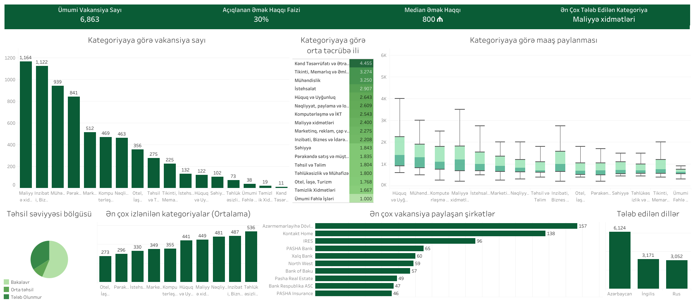

# Azerbaijan Job Market Analysis

This project gathers actionable insights about the current state of the Azerbaijan job market.

## Main Goal

Job seekers don't have a source of truth to understand current market requirements and adapt their career plans accordingly. This project aims to give them a general overview of the market: what employers are actually asking for in terms of education, experience, and language requirements.

## How It Works

1. **Scrape** - job listings are collected from jobsearch.az on a weekly basis.
2. **Extract** - an regex based extractor parses each listing to pull structured fields: education level, years of experience required, and required languages.
3. **Store** - extracted data is loaded into a SQL database using SQLite for querying and aggregation.
4. **Visualize** - aggregated data is published to a [Tableau Dashboard](https://public.tableau.com/app/profile/aslan.aslanl./viz/AzerbaijanJobMarketAnalysis/Dashboard) for exploration.

## Data

- **Source:** [jobsearch.az](https://www.jobsearch.az)
- **Collection period:** April - July 2026
- **Volume:** 6,872 listings at time of last extraction run

## Insights

Please visit the [Tableau Dashboard](https://public.tableau.com/app/profile/aslan.aslanl./viz/AzerbaijanJobMarketAnalysis/Dashboard) to explore the results interactively.



## Performance

Extractor accuracy was evaluated on a hand-labeled random sample of 150 listings (2.18% of the full data, N=6,872). Precision, recall, and 95% confidence intervals were computed per class.

### Education Level

**Overall accuracy:** 0.980 (95% CI: 0.943–0.993)

| Class | Support | Precision | Precision 95% CI | Recall | Recall 95% CI |
|---|---|---|---|---|---|
| Bachelor | 88 | 0.989 | [0.938, 0.998] | 0.989 | [0.938, 0.998] |
| Not Mentioned | 43 | 0.977 | [0.882, 0.996] | 1.000 | [0.918, 1.000] |
| Middle | 19 | 0.944 | [0.742, 0.990] | 0.895 | [0.686, 0.971] |

- `Master` and `Not Required` (each ~17/6,872 listings, ~0.25% of the data) did not appear in the random sample and were not evaluated via this method.

### Experience Years

**Exact match rate:** 0.990 (95% CI: 0.945–0.998)

**Mean Absolute Error:** 0.040 years

- Evaluated on 99 listings where experience was both mentioned and successfully extracted.

### Required Languages

**Overall performance (micro-avg):** Precision: 0.996, Recall: 0.976

| Language | Support | Precision | Precision 95% CI | Recall | Recall 95% CI |
|---|---|---|---|---|---|
| Azerbaijani | 139 | 1.000 | [0.972, 1.000] | 0.964 | [0.919, 0.985] |
| English | 81 | 0.988 | [0.933, 0.998] | 0.975 | [0.914, 0.993] |
| Russian | 67 | 1.000 | [0.946, 1.000] | 1.000 | [0.946, 1.000] |

- Language of the job posting itself is included as a required language, since a candidate needs to understand that language to read and apply for the job.

## Tech Stack

- Scraping: Python, requests
- Storage: SQLite
- Extraction: Regex
- Visualization: Tableau
- Dependency management: [uv](https://docs.astral.sh/uv/)

## How to Install

This project requires [uv](https://docs.astral.sh/uv/).

#### Clone the repository:
```
git clone https://github.com/aslanli-aslan/azerbaijan-jobs-analysis.git
cd azerbaijan-jobs-analysis
```

#### Install dependencies:
```
uv sync
```

## How to Run

I set up poe tasks for scraping, cleaning and extraction steps. You can use them as accordingly:
```
# Run the scraper
uv run poe scrape

# Run the cleaning pipeline
uv run poe clean

# Run the extraction pipeline
uv run poe extract
```

## Usage of AI Tools in This Project

I wrote the initial version of the scraper, then used AI to add SQL and concurrency support.

I also used AI to evaluate the quality of the project and the extraction results specifically.

## Contact

LinkedIn: [Aslan Aslanli](https://www.linkedin.com/in/aslanli-aslan)